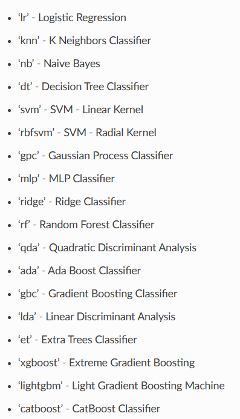

# AutoML (Streamlit + PyCaret)

Personal project to quickly explore a dataset, apply simple transformations, and train machine learning models end‑to‑end via a clean Streamlit UI.

## What it is

An automated ML model builder. It leverages PyCaret under the hood to compare a suite of algorithms and train the best model for your dataset with minimal code. You can upload a CSV, profile it, make quick edits, and one‑click “Compare and train best” to get a trained model you can download.

## Why I made it

I used to get many ML assignments and was too lazy to rewrite the same scikit‑learn boilerplate again and again. I was kind of bored of it, so I built this to train models without doing much — and, yes, to snag easy A+ grades.

- You can skip a lot of boring preprocessing: pandas profiling (ydata‑profiling) gives you an instant report.
- Visualize the data, drop columns on the 2nd page, and run additional operations on the dataframe via a simple code box.
- PyCaret has a lot more functionality I haven’t combined yet — but the app is easy to extend if you want to plug in more steps/models.

## Features

- Upload CSV data from the UI (Tab 1)
  - View the dataframe
  - Generate a profiling report (ydata‑profiling) in‑app
- Data prep (Tab 2)
  - Drop selected columns
  - Apply quick transformations via a code text area (evaluated against the in‑memory dataframe)
  - Preview results
- Modeling (Tab 4)
  - Regression or Classification workflows powered by PyCaret
  - One‑click “Compare and train best” to auto‑select and train the best model
  - “Custom” mode: create a model by name (e.g., "rf", "xgboost", etc.)
  - Optional GPU toggle for supported models
  - Download the trained model as `trained_model.pkl`

Note: Tab 3 is currently a placeholder.

## Screenshots

Below are some screenshots from the app:



The image above shows the list of models you can select from on the Modeling tab.

Additional screenshots:


## Current status / limitations

- On the Modeling page (Tab 4), only one of Regression or Classification is currently fully working; the other is planned for the next iteration.
- The transformation text area in Tab 2 evaluates Python expressions against the dataframe (use with care).

## Project structure

```
AutoML/
  automl/
    1.py              # Streamlit app entrypoint
    2.py, 3.py, 4.py  # Additional pages/utilities (if used)
    income.csv        # Example dataset
    logs.log          # Example logs
    models.png        # Asset
  README.md
```

## Environment setup

Recommended: Python 3.11 (PyCaret works well on 3.11).

Using conda (recommended):

```cmd
conda create -n automl311 -c conda-forge python=3.11 -y
conda activate automl311
conda install -c conda-forge pycaret streamlit ydata-profiling streamlit-pandas-profiling -y
```

Alternatively with pip (inside a virtualenv with Python 3.11):

```cmd
pip install streamlit pycaret ydata-profiling streamlit-pandas-profiling
```

## Run the app

From the repo root:

```cmd
streamlit run automl/1.py
```

Then:

- Tab 1: Upload your CSV, view, and optionally generate a profile report
- Tab 2: Drop columns, optionally apply a quick transformation
- Tab 4: Choose Regression or Classification → “Compare and train best” or “Custom” → train → download model

## Notes

- The app saves the trained model to `saved_model.pkl` and exposes a download button.
- If you see environment/import issues (NumPy/Pandas), use a clean Python 3.11 conda env and install via `conda-forge` as above.

## Roadmap

- Finish the remaining Modeling workflow (Regression/Classification) on Tab 4
- Add richer data cleaning helpers to Tab 2 (encode, impute, scale)
- Add evaluation dashboards and confusion matrix/ROC for classification
- Persist projects/configs


